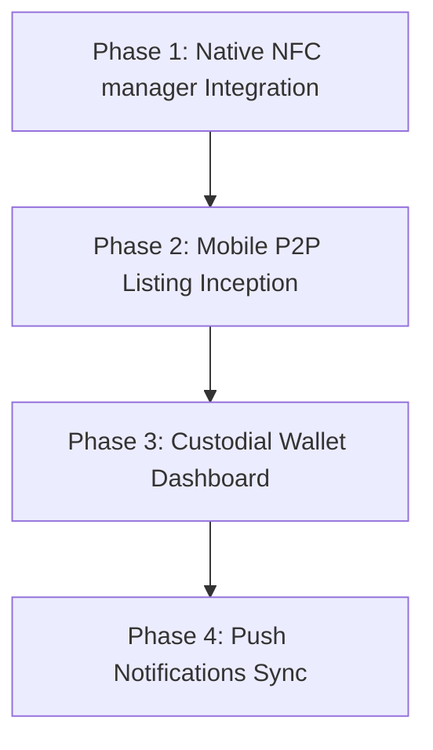

# Luxtrace Mobile: Consumer Features Implementation Plan

This implementation plan outlines the technical steps, library configurations, and structural design required to implement the remaining consumer features in the Luxtrace Expo mobile application.

---

## 📋 Roadmap Overview



---

## 🛠️ Phase 1: Native NFC Chip Reading [COMPLETED]

Currently, the mobile app simulates the NFC scan via manual UID text entry. We will integrate `react-native-nfc-manager` to read ISO/IEC 14443 Type A/B physical NFC tags.

### 1. Dependencies Installation
```bash
npx expo install react-native-nfc-manager
```

### 2. Configuration (`app.json` expo plugins)
Add the NFC plugin config to the app config to inject iOS and Android permissions:
```json
{
  "expo": {
    "plugins": [
      [
        "react-native-nfc-manager",
        {
          "nfcPermission": "Allow Luxtrace to read luxury product physical tags for authenticity checks."
        }
      ]
    ]
  }
}
```

### 3. Implementation Plan for `scan.tsx`
* **Trigger native NFC listener** when the camera QR scan is completed.
* **NFC Utility Handler**:
  ```typescript
  import NfcManager, { NfcTech } from 'react-native-nfc-manager';

  async function readNfcTagUid() {
    try {
      await NfcManager.requestTechnology(NfcTech.Ndef);
      const tag = await NfcManager.getTag();
      console.log('NFC Tag Read Successfully:', tag.id);
      return tag.id; // Return physical tag UID to trigger backend verification
    } catch (ex) {
      console.warn('NFC read aborted or failed', ex);
    } finally {
      await NfcManager.cancelTechnologyRequest();
    }
  }
  ```

---

## 📈 Phase 2: Mobile P2P Listing Inception (Sell & Handover) [COMPLETED]

Enable consumers to sell their registered luxury digital twins directly from the **My Vault** screen, generating the P2P Escrow on the backend.

### 1. New Screens / Routes
* `products/[id]/transfer.tsx`: Transfer configuration screen (inputting price, selection of Remote Shipping or Direct Handover, and entering Buyer's email/wallet address).

### 2. Backend API Integration
Call `POST /api/p2p/direct/init` or `POST /api/p2p/shipping/init` with the selected target parameters:
```typescript
const initEscrow = async (productId: string, amount: number, buyerEmail: string) => {
  const response = await fetch(`${API_BASE_URL}/p2p/direct/init`, {
    method: 'POST',
    headers: { 'Content-Type': 'application/json', 'Authorization': `Bearer ${token}` },
    body: JSON.stringify({ product_id: productId, amount_idr: amount, buyer_email: buyerEmail }),
  });
  return response.json();
}
```

---

## 💳 Phase 3: Custodial Wallet Dashboard [COMPLETED]

A detail view for the custodial wallet generated on login via Thirdweb.

### 1. Wallet Detail Tab
* Add a sub-page/modal displaying:
  * **Balance**: Fetching native tokens (Sepolia ETH) and digital luxury twin ERC-721 status.
  * **Transactions**: History of on-chain executions associated with the wallet.
* **Provider Integration**: Interacting with Sepolia RPC via Thirdweb SDK to fetch balances.

---

## 🔔 Phase 4: Push Notifications Sync

Alert consumers when status shifts occur (e.g. Escrow funded, Handover verified, or Item in transit).

### 1. Expo Notifications Installation
```bash
npx expo install expo-notifications expo-device
```

### 2. Token Registration Flow
* Request permissions on app boot (`_layout.tsx`).
* Store Push Tokens against Supabase Profile record in backend.
* Use Upstash Redis webhooks or Supabase Database Triggers to broadcast notifications to Expo Push service when status changes occur.
