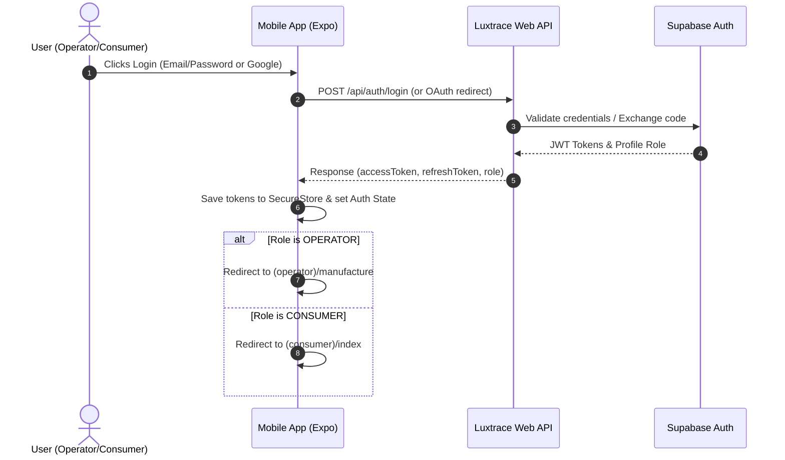
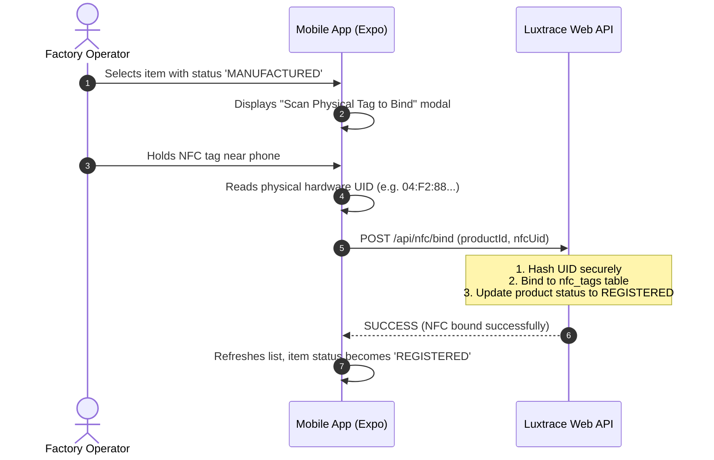
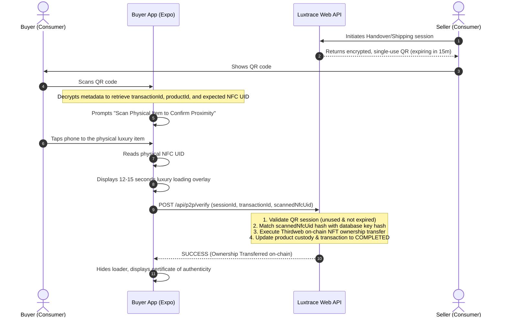

# Luxtrace Mobile Architecture Blueprint (Phase 1)

This blueprint defines the architecture, folder structure, and workflows for the Luxtrace Mobile Application using **React Native (Expo)**.

---

## 1. Architectural Constraints (Security First)
- **API-Only Client**: The mobile app is strictly a client. It does not access Supabase directly nor execute on-chain smart contracts. It only consumes the backend REST API.
- **No Client-Side NFC Decryption**: The mobile app reads the raw NFC UID from the physical tag and sends it directly to the backend. It does not perform local authentication of key hashes.
- **Blockchain Finality HOC**: All state changes requiring block confirmation on Sepolia (such as escrow release or handover) must wrap the UI in a **12-15 second premium animated loader** to prevent race conditions.

---

## 2. Directory Structure (Expo Router)

Using modern file-based routing with `expo-router`:

```
luxtrace-mobile/
├── app/                        # Expo Router Pages
│   ├── (auth)/                 # Authentication Group
│   │   ├── login.tsx           # Login Screen (Email + Google OAuth)
│   │   └── register.tsx        # Register Screen
│   ├── (operator)/             # Operator-Only Screens (Protected)
│   │   ├── _layout.tsx         # Role Guard Layout
│   │   ├── manufacture.tsx     # Batch manufacturing list & state
│   │   └── bind-nfc.tsx        # Physical NFC tag binding terminal
│   ├── (consumer)/             # Consumer-Only Screens (Protected)
│   │   ├── _layout.tsx         # Role Guard Layout
│   │   ├── index.tsx           # Handover / Owned Assets Tab (Dashboard)
│   │   ├── escrows.tsx         # Active P2P escrows (Remote / Direct)
│   │   └── scan.tsx            # Standalone Authenticity Checker
│   ├── provenance/             # Publicly Accessible Page
│   │   └── [productId].tsx     # Vertical provenance timeline view
│   ├── _layout.tsx             # Root Context Provider & Global Loader
│   └── index.tsx               # Redirect handler based on token & role
├── components/                 # Reusable Luxury Components
│   ├── LuxuryButton.tsx        # Button with glow effects
│   ├── LuxuryCard.tsx          # Card with transparent dark green borders
│   ├── PremiumLoader.tsx       # 12-15s transaction lock overlay
│   └── NfcScannerModal.tsx     # Bottom-sheet for NFC scanning animation
├── hooks/                      # Custom React Hooks
│   ├── useAuth.ts              # Authentication state provider
│   ├── useNfc.ts               # Core CoreNFC/Ndef hardware listener wrapper
│   └── useApi.ts               # Custom axios wrapper with JWT interception
├── services/                   # Backend Communication Layer
│   ├── auth.service.ts         # Login/register/Google OAuth API wrapper
│   ├── product.service.ts      # Fetch provenance, status, bind NFC API
│   └── transaction.service.ts  # Escrow, Direct Handover, Remote Shipping API
├── constants/                  # Configuration & Themes
│   └── Colors.ts               # #0A0A0A, #00FFB2, #0F2A25, opacity values
└── package.json
```

---

## 3. Roles & Permissions

| Role | Allowed Tabs/Screens | Permissions & Functions |
| :--- | :--- | :--- |
| **OPERATOR** | `(auth)`, `(operator)` | - View factory batches and `MANUFACTURED` assets.<br>- Bind hardware NFC tags sequentially (`POST /api/nfc/bind`). |
| **CONSUMER** | `(auth)`, `(consumer)` | - View current owned products (`current_owner_id = user_id`).<br>- Initiate P2P Direct Handover sessions.<br>- Scan & verify physical NFC tags to release escrows (`POST /api/p2p/verify`). |

---

## 4. Workflows & Core Flows

### A. Authentication Flow (OAuth / Password)


---

### B. Manufacturing & Tag Binding (Operator Flow)


---

### C. Secondary Market P2P Escrow & Verification (Consumer Flow)
This applies to both **Direct Handover** and **Remote Shipping**:


